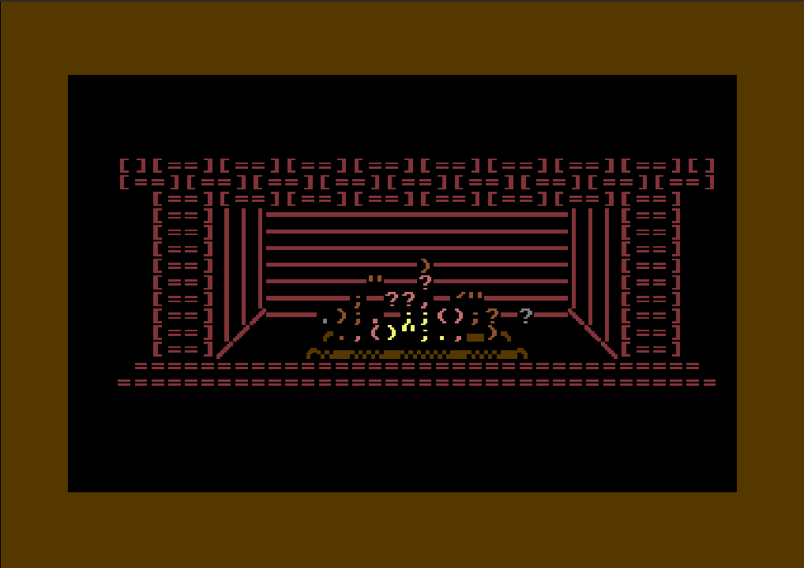

# PETSCII Fireplace - Commodore 64

This is a small animated petscii fireplace written in 6502 Assembly (using Kickassembler) on the Commodore 64.

I made it mainly to learn a bit about the C64 and 6502 Assembly so this is most definetly not the most efficient way of doing it



## How to run it

You need to install [Kickassembler](http://www.theweb.dk/KickAssembler/Main.html#frontpage) and run the following command:

```
java -jar KickAss.jar -odir ./bin entry.asm
```
(Replace "KickAss.jar" with the path to the assembler)

After compiling you can use VICE to run it:
```
x64 bin/entry.prg
```

You should also be able to run it on a real C64 using a Ultimate II+ or recompiling it as a Disk or Tape image (Didn't figure out how to do that).

## Changing the image
### Background image
The Background image was created using [Petmate](https://nurpax.github.io/petmate/). You can open the ``PetsciiFireplace.petmate`` file in Petmate and export a KickAssembler assembly file named ``fire.asm`` using Petmates export menu.

### Changing behaviour
The fire generation is hardcoded in assembly by generating random numbers you can change the values in ``entry.asm`` at the ``next:`` label where the probability for a character, position and color is defined.

The values at the ``firechars:`` label define the 8 possible characters that can apper, to extend or shorten this list you have to modify the ``RandomFireLine`` macro. Modifying it without changing the length can be done without changing the code.

The speed is defined by the ``ticktime`` constant.


